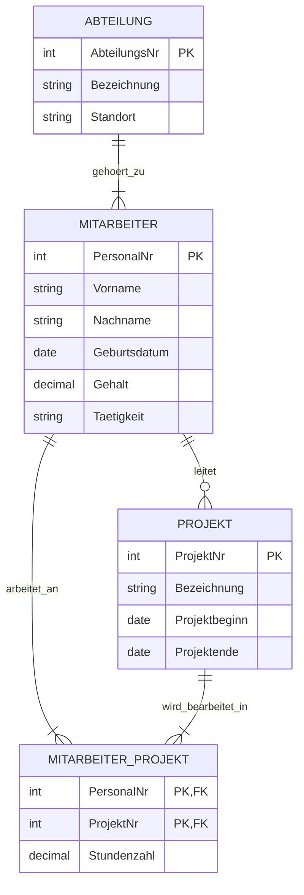

# Project & Employee Database Design

## Overview & Task Requirements

This repository contains the database architecture for an enterprise resource management system handling departments, employees, and projects.

### Task Specifications

1. **Entity-Relationship Model**: Design a conceptual model mapping entities, attributes, cardinalities, and relationships based on the following domain rules:
* **Department (`Abteilung`)**: Identified by `AbteilungsNr`, holds `Bezeichnung` and `Standort`. Employs multiple employees (1:n).
* **Employee (`Mitarbeiter`)**: Identified by `PersonalNr`, holds `Vorname`, `Nachname`, `Geburtsdatum`, `Gehalt`, and `Tätigkeit`. Assigned to exactly one department. Can lead multiple projects (1:n) and work on multiple projects (n:m).
* **Project (`Projekt`)**: Identified by `ProjektNr`, holds `Bezeichnung`, `Projektbeginn`, and `Projektende`. Managed by exactly one employee. Employs multiple team members whose contributed hours (`Stundenzahl`) are tracked.

2. **Relational Schema (3NF)**: Normalize the model into 3rd Normal Form with appropriate SQL data types, primary keys (PK), and foreign keys (FK).

---

## Entity-Relationship Diagram (ERD)

---

## Relational Database Schema (3NF)

### 1. `Abteilung`

| Column | Data Type | Constraints | Description |
| --- | --- | --- | --- |
| **AbteilungsNr** | INT | **PK** (NOT NULL) | Unique department ID |
| **Bezeichnung** | VARCHAR(100) | NOT NULL | Department name |
| **Standort** | VARCHAR(100) | NOT NULL | Department location |

### 2. `Mitarbeiter`

| Column | Data Type | Constraints | Description |
| --- | --- | --- | --- |
| **PersonalNr** | INT | **PK** (NOT NULL) | Unique employee ID |
| **Vorname** | VARCHAR(50) | NOT NULL | First name |
| **Nachname** | VARCHAR(50) | NOT NULL | Last name |
| **Geburtsdatum** | DATE | NOT NULL | Date of birth |
| **Gehalt** | DECIMAL(10,2) | NOT NULL | Monthly salary |
| **Tätigkeit** | VARCHAR(100) | NOT NULL | Job position/role |
| **AbteilungsNr** | INT | **FK** (NOT NULL) | References `Abteilung(AbteilungsNr)` |

### 3. `Projekt`

| Column | Data Type | Constraints | Description |
| --- | --- | --- | --- |
| **ProjektNr** | INT | **PK** (NOT NULL) | Unique project ID |
| **Bezeichnung** | VARCHAR(100) | NOT NULL | Project title |
| **Projektbeginn** | DATE | NOT NULL | Start date |
| **Projektende** | DATE | NULL | End date (`NULL` if active) |
| **Leiter_PersonalNr** | INT | **FK** (NOT NULL) | References `Mitarbeiter(PersonalNr)` |

### 4. `Mitarbeiter_Projekt`

| Column | Data Type | Constraints | Description |
| --- | --- | --- | --- |
| **PersonalNr** | INT | **PK, FK** (NOT NULL) | References `Mitarbeiter(PersonalNr)` |
| **ProjektNr** | INT | **PK, FK** (NOT NULL) | References `Projekt(ProjektNr)` |
| **Stundenzahl** | DECIMAL(6,2) | NOT NULL | Total hours logged on project |