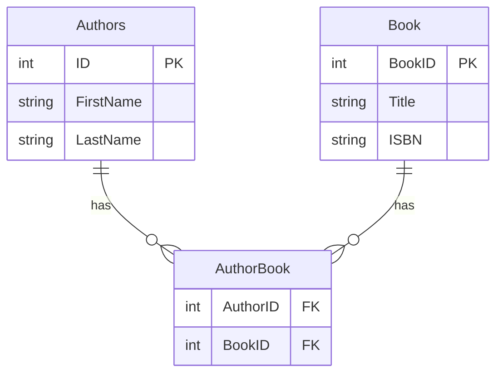

# My First SQL DB

This folder contains a **self‑contained** script that demonstrates a simple relational model (Authors ↔ Book ↔ AuthorBook) on SQL Server. The script is designed for rapid development:

* **Starts in `master`**, drops and recreates the `MyFirstSqlDb` database on every run.
* Defines tables with proper primary‑key and foreign‑key constraints.
* Inserts a small set of sample data.
* Ends with `SELECT` statements that verify the data.

---
### How to run
```powershell
sqlcmd -S .\SQLEXPRESS -d master -i "sql\MyFirstSql\My-first-sql-db.sql" -C
```
* `-S .\SQLEXPRESS` – your local Express instance.
* `-d master` – required so the script can drop/create the target database.
* `-C` – trusts the self‑signed certificate (needed for ODBC Driver 18).

---
### Core script excerpt
```sql
USE master;
GO

-- 0. Drop and recreate database for clean testing
IF DB_ID('MyFirstSqlDb') IS NOT NULL
BEGIN
    ALTER DATABASE MyFirstSqlDb SET SINGLE_USER WITH ROLLBACK IMMEDIATE;
    DROP DATABASE MyFirstSqlDb;
END;
GO
CREATE DATABASE MyFirstSqlDb;
GO
USE MyFirstSqlDb;
GO

-- Authors table
CREATE TABLE Authors (
    ID INT IDENTITY(1,1) NOT NULL,
    FirstName NVARCHAR(50) NOT NULL,
    LastName NVARCHAR(50) NOT NULL,
    CONSTRAINT PK_Authors PRIMARY KEY (ID)
);
GO

-- Book table (singular)
CREATE TABLE Book (
    BookID INT IDENTITY(1,1) NOT NULL,
    Title NVARCHAR(100) NOT NULL,
    ISBN NVARCHAR(20) UNIQUE,
    CONSTRAINT PK_Book PRIMARY KEY (BookID)
);
GO

-- Junction table
CREATE TABLE AuthorBook (
    AuthorID INT NOT NULL,
    BookID INT NOT NULL,
    CONSTRAINT PK_AuthorBook PRIMARY KEY (AuthorID, BookID),
    CONSTRAINT FK_AuthorBook_Authors FOREIGN KEY (AuthorID) REFERENCES Authors(ID),
    CONSTRAINT FK_AuthorBook_Book FOREIGN KEY (BookID) REFERENCES Book(BookID)
);
GO
```
---
### Verification
After execution the script prints the contents of each table:
```sql
SELECT * FROM Authors;
SELECT * FROM Book;
SELECT * FROM AuthorBook;
```
You should see two authors, two books, and the linking rows.

---
Feel free to extend the schema, add more data, or modify the verification queries.


This script sets up a simple relational model in the `MyFirstSqlDb` database, containing:

- **Authors** – `ID` (PK), `FirstName`, `LastName`
- **Book** – `BookID` (PK), `Title`, `ISBN`
- **AuthorBook** – junction table linking authors to books (`AuthorID`, `BookID`)

The script drops any existing tables (in the correct order) and recreates them with primary‑key and foreign‑key constraints. Sample data for two authors and two books is inserted, followed by verification `SELECT` statements.

## ER Diagram

